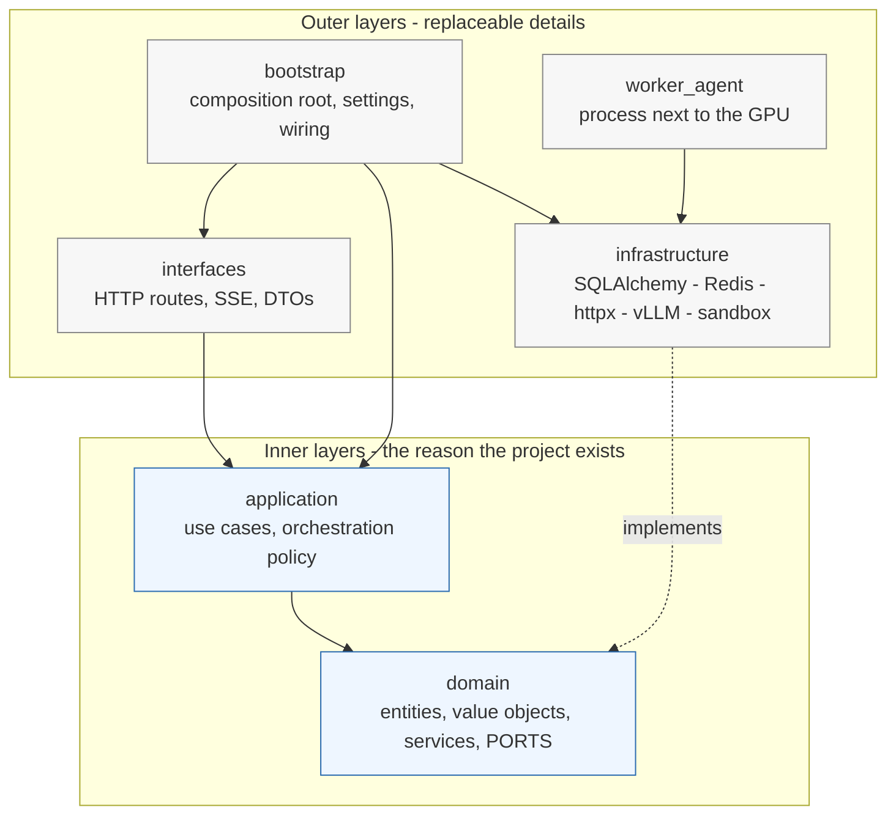
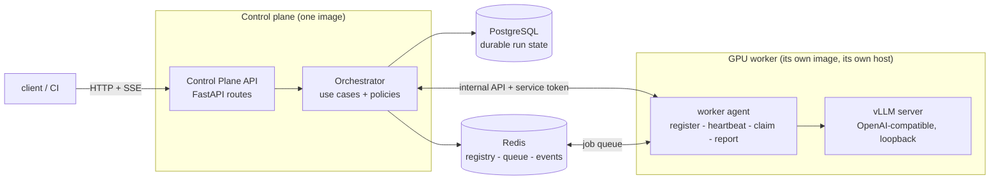
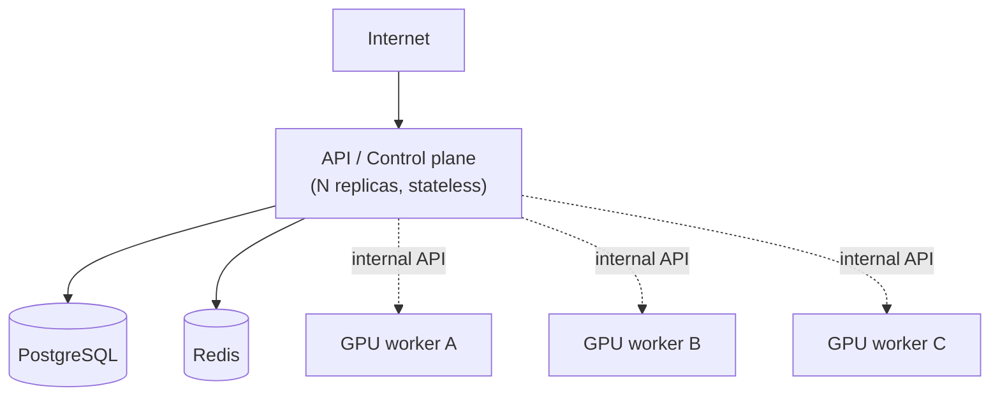

# Architecture

> **What this document claims.**
> Everything described as *implemented* was read in this repository: the `domain`
> layer (`src/domain/`), the architecture tests (`tests/architecture/`) and the
> tooling (`pyproject.toml`, Dockerfiles, `docker-compose.yml`, CI).
> Everything marked **[target]** is the agreed architecture whose code is being
> written concurrently; treat those paragraphs as the contract the other layers
> are expected to honour, not as a description of existing files.

---

## 1. Why layers at all

The platform must survive three kinds of change without a rewrite:

* the inference engine changes (vLLM today, something else tomorrow);
* the infrastructure changes (Redis queue, another broker, a managed service);
* the GPU fleet changes *at runtime* (workers appear, vanish, drain).

Clean Architecture buys exactly that: the rules that decide *what the platform
does* never import the machinery that decides *how it is done*. A worker
disappearing mid-run is a domain rule; talking to Redis is a detail.

## 2. Layer map and the dependency rule

The single rule: **arrows point inwards, and the dotted arrow is the only way
out**. `infrastructure` never receives a call from `domain`; it *implements the
Protocols that `domain` declares* (`src/domain/ports/`), and `bootstrap` is the
one place allowed to know both sides.

| Layer | May import | Must never import |
|---|---|---|
| `domain` | stdlib only | any other layer, any framework |
| `application` | `domain` | `infrastructure`, `interfaces`, `bootstrap`, `worker_agent`, FastAPI, SQLAlchemy, Redis |
| `infrastructure` | `domain`, `application` | `interfaces`, `bootstrap` |
| `interfaces` | `application`, `domain` | `infrastructure` (adapters arrive injected) |
| `bootstrap` | everything | — |
| `worker_agent` | `domain`, `infrastructure` | `interfaces` |

### This is enforced, not hoped for

`tests/architecture/test_dependency_rule.py` (implemented) parses the AST of
every module and fails the build when:

* an inner layer imports an outer one;
* `fastapi`, `starlette`, `sqlalchemy`, `alembic`, `redis`, `httpx`, `pydantic`,
  `uvicorn` or `prometheus_client` appear inside `domain`
  (a shorter list for `application`);
* `domain` calls `datetime.now()` / `datetime.utcnow()` — time is injected
  through the `Clock` port, so a run is reproducible and testable;
* a module other than the identifier factories mints a UUID.

It runs in the `test-unit` CI job, needs no Docker and no GPU.

## 3. What lives in the domain today

Read from `src/domain/` (implemented):

* **Entities** — `Project`, `Run`, `Plan`, `Candidate`, `Job`, `Review`,
  `Worker`. They own their invariants and record domain events; none of them
  knows a database exists.
* **Value objects** — identifiers, `Lease`/`LeaseToken`, `WorkerCapabilities`,
  `WorkerEndpoint`, `WorkerLoad`, `JobRequirements`, `GpuSpec`, patches,
  workspace handles, LLM request/result shapes, limits, validation results.
* **Domain services** — `RunStateMachine` (the transition table of a run),
  `RetryPolicy` (kind-aware, bounded, exponential backoff),
  `LeastLoadedCompatibleScheduler` and `RoundRobinScheduler`,
  `DeterministicCandidateSelectionPolicy`, `HeuristicTaskComplexityPolicy`.
* **Events** — run, job and worker events (`RunCreated`, `PlanCompleted`,
  `CandidateSelected`, `JobLeased`, `JobLeaseExpired`, `WorkerRegistered`,
  `WorkerUnavailable`, ...).
* **Ports** — the Protocols (plus their small data carriers) exported by
  `src/domain/ports/__init__.py`, listed in section 5.

Two design choices worth naming, because they explain most of the code:

1. **The run state machine is a table, not a recursive agent loop.** A run moves
   `CREATED → PLANNING → PLAN_READY → CODING → VALIDATING → REVIEWING →
   COMPLETED`, with `REPAIRING` looping back to `CODING`, `CANCELLING` reachable
   from any non-terminal state, and `FAILED` always reachable. An illegal move
   raises, whichever use case attempted it.
2. **Worker eligibility is decidable offline.** `Worker.can_accept(requirements)`
   answers from declared capabilities alone — status, free slots, supported
   role, model pin, tool support, structured-output support, context length. No
   network call, hence no scheduling decision that cannot be unit-tested.

## 4. Components

### Control Plane API — **[target]** `src/interfaces/`
Translates HTTP into use cases and nothing else: no business logic in routes.
Public surface: projects, runs, run status, cancellation, events (SSE), worker
inspection, health/readiness. Internal surface, protected by `SERVICE_TOKEN`:
worker registration, heartbeat, drain, deregistration.

### Orchestrator — **[target]** `src/application/`
The brain. Decides which job to schedule next from the run state, launches
parallel candidates, aggregates deterministic validation, triggers repair,
respects retry budgets, reacts to workers appearing and disappearing. It never
assumes a fixed number of GPUs and never issues an HTTP call from domain logic:
it asks ports.

### GPU worker — `src/worker_agent/` **[target]**, packaged by `docker/worker.Dockerfile` (implemented)
An independent container holding one inference server. The agent registers its
capabilities, heartbeats, claims jobs, reports results, and drains on shutdown.
The orchestrator knows only `WORKER_ENDPOINT` and the declared capabilities —
never that vLLM is on the other side. See [worker-lifecycle.md](worker-lifecycle.md).

### PostgreSQL
The only durable source of truth for run state: projects, runs, plans, jobs,
candidates, reviews, tool summaries, patch metadata, events.

### Redis
Fast, *expendable* state: worker registry with heartbeat TTL, job queue and
leases, locks, event fan-out. Losing Redis costs in-flight scheduling, never the
run's history — that is why nothing durable lives there.

## 5. Ports, and what may be swapped behind them

Each port below is a `Protocol` in `src/domain/ports/` (implemented). The
adapters are **[target]**.

| Port | First adapter | Why it is behind a port |
|---|---|---|
| `LLMProvider`, `LLMProviderFactory` | vLLM / OpenAI-compatible HTTP; deterministic fake | The engine is the most likely thing to change, and CI must run without one |
| `JobQueue` | Redis (streams/lists) with leases | A managed broker or PostgreSQL-only queue must not require touching orchestration |
| `EventBus` | Redis pub/sub, consumed by SSE | Streaming transport is a delivery concern |
| `WorkerRegistry` | Redis with TTL | The fleet is dynamic; registry semantics are not |
| `*Repository`, `UnitOfWork`, `EventStore` | SQLAlchemy 2.x async + Alembic | Business rules must not be expressed in ORM models |
| `WorkspaceManager` | git worktree / copy per candidate | Candidate isolation is a rule; how it is isolated is not |
| `SandboxExecutor`, `ToolExecutor`, `ToolRegistry` | container sandbox with limits and timeouts | Agent-produced code is untrusted; the boundary may harden later (Firecracker, k8s jobs) |
| `RepositoryContextProvider` | ripgrep/heuristic selection | Context selection will be tuned constantly |
| `ArtifactStore` | local filesystem volume | S3 or equivalent later |
| `ComputeProvider` | none (optional) | RunPod-style autoscaling is an *optional* adapter; no provider API may reach the core |
| `Clock`, `IdGenerator` | system clock, uuid4 | Determinism in tests |
| `WorkerScheduler` | `LeastLoadedCompatibleScheduler` (in domain) | Scheduling policy is a strategy, chosen by configuration |

## 6. Request paths

**Creating a run** — `POST /runs` → use case → persist `Run(CREATED)` + event →
enqueue a `PLAN` job → HTTP 202. The client never waits behind inference.

**Executing a job** — a worker claims a job under a lease, renews it while it
runs, reports success or failure. The orchestrator reacts to the result and
decides the next transition. Nothing in the flow assumes *which* worker did it.

**Watching a run** — SSE over the `EventBus`; the durable copy of the same
events lives in PostgreSQL, so a reconnect does not lose history.

## 7. Failure semantics, in one place

| Failure | What happens |
|---|---|
| Worker stops heartbeating | Marked unavailable after `HEARTBEAT_TIMEOUT_SECONDS`; its leases expire; safe jobs are requeued and scheduled elsewhere |
| Worker drains | Accepts no new job (`WorkerStatus.DRAINING`), finishes current work, deregisters when idle |
| Infrastructure/inference failure | `RetryPolicy` → retry on another worker, within the job's attempt budget |
| Invalid structured output | Bounded re-ask with the validation error attached (`REPAIR_PROMPT`) |
| Code defect (compile/test/review) | Not a job retry: back into the agentic repair loop, bounded by `MAX_REPAIR_ITERATIONS` |
| Orchestrator restart | Run state is in PostgreSQL; in-flight jobs are recovered through lease expiry |

## 8. Deployment shape

The same images run locally and in production; only configuration moves.

Workers may live on other hosts (RunPod, a bare-metal H200 box, a laptop with a
fake adapter), may join during a run, and may disappear without invalidating
project state. Locally, `docker-compose.yml` provides the same topology with a
CPU-only fake worker; `--profile gpu` adds a real vLLM worker.

## 9. Related documents

* [worker-lifecycle.md](worker-lifecycle.md) — states, heartbeat, drain, lease recovery.
* [development.md](development.md) — install, run the stack, tests, attach a real GPU worker.
* `orchestration.md` and `api.md` — owned by the orchestration and API authors.
