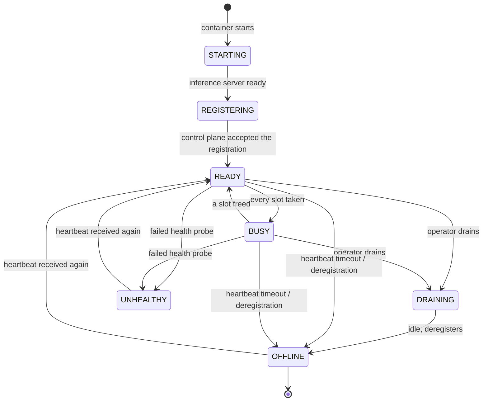
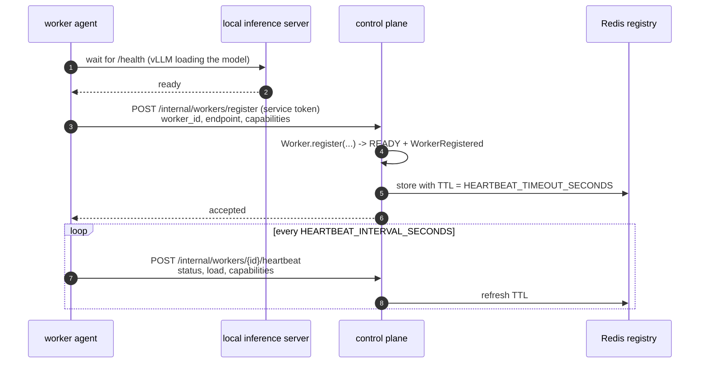
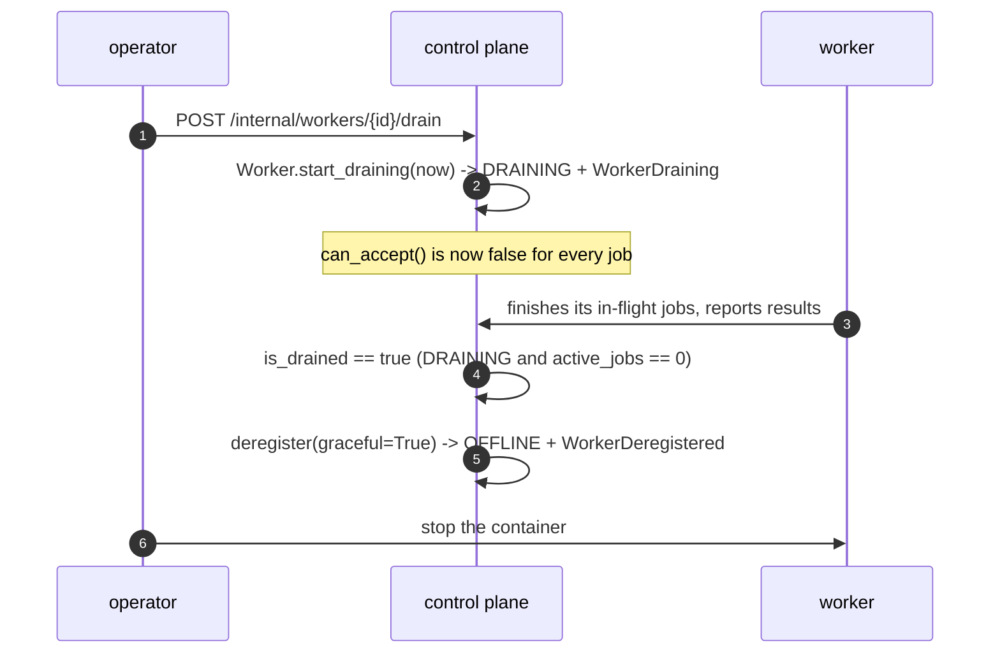
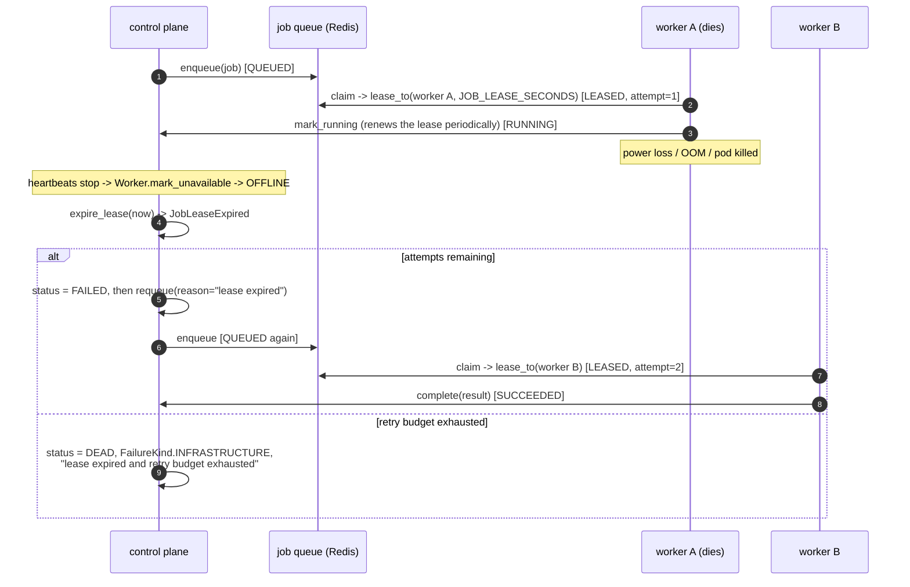

# Worker lifecycle

> **What this document claims.**
> The state rules below were read in `src/domain/entities/worker.py`,
> `src/domain/entities/job.py`, `src/domain/enums.py`,
> `src/domain/value_objects/lease.py` and `src/domain/ports/` — they are
> implemented and unit-tested (`tests/domain/test_worker_lifecycle.py`,
> `tests/domain/test_job_leasing.py`).
> HTTP endpoints, background sweepers and the worker process itself are marked
> **[target]**: their code is being written concurrently.

---

## 1. The states

`WorkerStatus` (`src/domain/enums.py`):



Two derived properties carry almost all the behaviour:

| Property | True for | Used for |
|---|---|---|
| `accepts_new_jobs` | `READY`, `BUSY` | Scheduling. `BUSY` still accepts work *if a slot is free*; `DRAINING` never does |
| `is_live` | everything except `OFFLINE`, `UNHEALTHY` | "may still be finishing accepted work" |

`STARTING` and `REGISTERING` describe the **worker process before the control
plane knows it**. On the control-plane side, `Worker.register(...)` creates the
aggregate directly in `READY` — a worker that has not completed registration is
simply not in the registry.

### `READY` ↔ `BUSY` is computed, never declared

`Worker._sync_busy()` recomputes the flag from capacity after every slot
reservation, release and heartbeat: `BUSY` when `available_slots == 0`, `READY`
otherwise. It deliberately touches nothing else, so **a heartbeat can never
resurrect a draining worker into service**.

## 2. Registration



What a worker declares (`WorkerCapabilities`, implemented): `model_id`,
`context_length`, `max_concurrency`, `supported_roles`, `gpu` (`GpuSpec`:
type, count, memory, tensor-parallel size), `supports_tools`,
`supports_json_schema`, free-form `metadata`.

`WORKER_ENDPOINT` must be reachable **from the control plane**, not from the
worker: inside Compose that is the service name, on a remote GPU host its
public or VPN address.

Endpoints (spec section 19) — **[target]**:

```text
POST   /internal/workers/register
POST   /internal/workers/{worker_id}/heartbeat
POST   /internal/workers/{worker_id}/drain
DELETE /internal/workers/{worker_id}
GET    /internal/workers/{worker_id}/health
```

All of them are protected by `SERVICE_TOKEN`.

## 3. Heartbeats

`Worker.heartbeat(now, status=None, load=None, capabilities=None)`:

* refreshes `last_heartbeat_at`;
* optionally refreshes self-reported load and capabilities (a worker may change
  its concurrency at runtime);
* applies an explicitly reported status, **or** — if the worker was `OFFLINE` /
  `UNHEALTHY` — readmits it to `READY`. A network partition must not
  permanently remove a healthy GPU;
* recomputes `READY`/`BUSY`;
* records `WorkerHeartbeatReceived`.

Staleness is one comparison, `Worker.is_stale(now, timeout)`:
`now - last_heartbeat_at > timeout`, with `timeout` from
`HEARTBEAT_TIMEOUT_SECONDS`. Keep it at three to six times
`HEARTBEAT_INTERVAL_SECONDS`: shorter and a GC pause evicts a healthy worker,
longer and a dead worker holds its jobs hostage.

A reaper **[target]** sweeps the registry every `REAPER_INTERVAL_SECONDS`,
calls `mark_unavailable` on stale workers and then reclaims their leases
(section 6). `WorkerRegistry.reap_stale(...)` is the port it uses.

## 4. Scheduling: who is eligible

`Worker.can_accept(requirements)` is a chain of guard clauses, each with a
matching human reason in `rejection_reason(...)`, so a scheduling failure is
diagnosable instead of mysterious:

1. `status.accepts_new_jobs` — excludes `DRAINING`, `OFFLINE`, `UNHEALTHY`;
2. `available_slots > 0`;
3. the role is in `supported_roles`;
4. the pinned `model_id`, if the job pins one, matches;
5. tool calling is supported, if required;
6. structured output is supported, if required;
7. the estimated prompt fits `context_length`.

**Draining is enforced here, on the entity**, not in the scheduler — no policy
can bypass it by accident. `LeastLoadedCompatibleScheduler` (default) then
orders the eligible workers by utilisation; `RoundRobinScheduler` is the
alternative, selected by `SCHEDULER_STRATEGY`.

`reserve_slot()` raises `WorkerUnavailableError` rather than silently
over-committing, and keeps the in-memory load consistent between heartbeats,
which are far too coarse for scheduling.

## 5. Draining and removal



* `start_draining` is idempotent and refuses to drain an already-dead worker
  (`OFFLINE`/`UNHEALTHY` raise `InvalidStateTransitionError`).
* `is_drained` is the precise "safe to switch off" signal.
* `deregister(graceful=False)` covers the abrupt path; the state ends `OFFLINE`
  either way, only the event differs.
* Removing a worker never invalidates project or run state: runs live in
  PostgreSQL and are bound to jobs, never to a machine.

`WORKER_DRAIN_TIMEOUT_SECONDS` bounds how long the worker agent waits for its
own jobs before exiting anyway; whatever it abandons is recovered by lease
expiry.

## 6. When a worker vanishes: recovery through lease expiry

This is the mechanism that makes worker loss boring.

Every claimed job holds a `Lease` (`job_id`, `holder`, `token`, `expires_at`).
The holder must renew it while it works; `JOB_LEASE_SECONDS` is the initial
duration.



Implemented guarantees (`Job`):

* `lease_to` only accepts a `QUEUED` job and increments `attempt` — an attempt
  is counted when the work is claimed, not when it is reported;
* every mutation carrying a `LeaseToken` is validated against the current lease
  (`_assert_lease`): a zombie worker coming back from the dead cannot complete a
  job that was reassigned — it gets `JobLeaseExpiredError`;
* `complete()` on an already-succeeded job is a **no-op, not an error**, and
  `cancel()` on a terminal job likewise: delivery is at-least-once, so replays
  must be harmless. `IdempotencyKey` covers the same need at creation time;
* `fail(kind, reason)` decides retryability from the failure kind by default:
  infrastructure, inference and tool failures deserve another worker;
  compilation, test and review failures are *not* job retries — they are work
  for the agentic repair loop;
* `expire_lease(now)` returns whether the job may be retried, and otherwise
  marks it `DEAD` with `FailureKind.INFRASTRUCTURE`.

The queue port mirrors this with `claim`, `renew`, `acknowledge`,
`release(requeue=...)` and `reclaim_expired(now, limit)`.

### Choosing the two timeouts

| Setting | Meaning | Rule of thumb |
|---|---|---|
| `HEARTBEAT_INTERVAL_SECONDS` | how often a worker says it is alive | 5-15 s |
| `HEARTBEAT_TIMEOUT_SECONDS` | silence before it is declared unavailable | 3-6 heartbeats |
| `JOB_LEASE_SECONDS` | how long a claim survives without renewal | longer than one inference step, shorter than human patience |
| `JOB_MAX_ATTEMPTS` | attempts before `DEAD` | 3 (default of `Job`) |

A lease shorter than a single generation step causes healthy jobs to be stolen
mid-flight; that is the classic misconfiguration to avoid.

## 7. Events emitted

`WorkerRegistered`, `WorkerHeartbeatReceived`, `WorkerStatusChanged`,
`WorkerDraining`, `WorkerUnavailable`, `WorkerDeregistered` (all implemented in
`src/domain/events/worker.py`), plus the job side: `JobEnqueued`, `JobLeased`,
`JobCompleted`, `JobFailed`, `JobLeaseExpired`, `JobRequeued`.

They are the audit trail of the fleet: any "why did this job move?" question is
answerable from them alone.

## 8. Operating a worker

Adding, draining and replacing workers, including a real vLLM/Qwen worker:
see [development.md](development.md).
